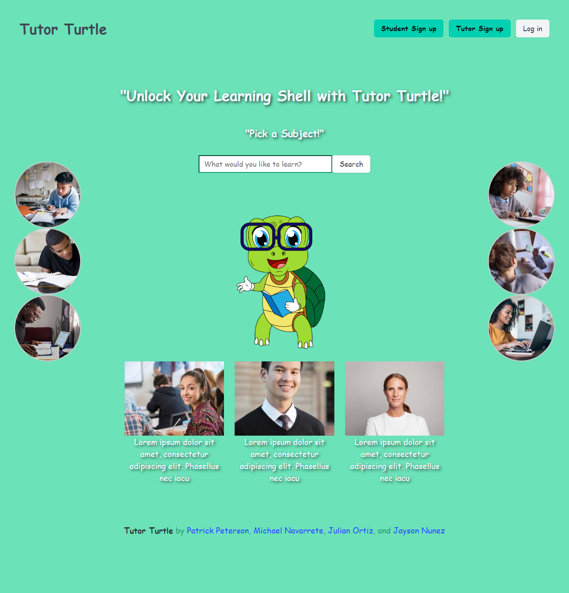

# tutor-turtle

## Description

Tutor Turtle is an online platform that brings tutors and students together in a fast and easy to use browser application; it only takes minutes to sign up for tutor-turtle, and can be accessed anywhere. This makes tutoring accessible and Private for students who need extra help or prefer private learning
## Table of Contents
- [Usage](#usage)
- [License](#license)
- [Contributing](#contributing)
- [Credits](#credits)

## Usage
To use Tutor Turtle you only need to navigate [this link](https://pennywise-47773ea2b3e1.herokuapp.com/).

## Screenshot ##

## License
This project is licensed under the [MIT](https://opensource.org/licenses/MIT) license.

## Credits
- [w3schools.com](https://w3schools.com)
- [developer.mozilla.org](https://developer.mozilla.org/en-US/)
- [shields.io](https://shields.io/)
- [npmjs.com](https://docs.npmjs.com/)
- [stackoverflow.com](https://stackoverflow.com/questions/)
- [chart.js](https://www.chartjs.org/docs/latest/)
- [heroku.com](https://devcenter.heroku.com/categories/reference/)

Tutor Turtle was brought to life thanks to the collaborative effort of a dedicated team:

- **Jayson Nunez**
- **Michael Navarrete**
- **Patrick**
- **Julian Ortiz**

Special thanks to all contributors who have invested their time and effort into making **Tutor Turtle** a valuable tool for everyone.

